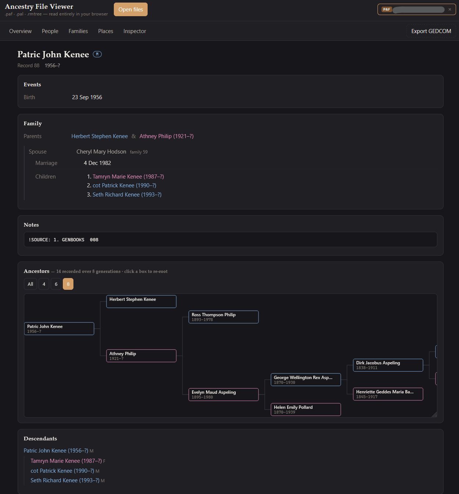

# Ancestry File Viewer



A dependency-free web app that opens four family-history file formats and shows the
genealogy inside them: people, events, families, pedigree charts and notes — plus a
GEDCOM 7.0 export so the data can be moved into modern software.

Open `index.html` in a browser. No server, no build step, no network access; every file
is parsed locally in the page.

| Format | What it is | Support |
|---|---|---|
| `.paf` | Personal Ancestral File 5 — undocumented binary | Reverse-engineered here (see below) |
| `.pal` | PAF activity log — plain text | Full |
| `.rmtree` | RootsMagic — SQLite 3 database | Full |
| `.ged` | GEDCOM 7.0 (and 5.5.1) | Read and written (see below) |

## Why this exists

PAF was discontinued by FamilySearch in 2013 and its binary format was never published,
so `.paf` files are effectively unreadable today. RootsMagic `.rmtree` files *are* SQLite,
but they declare a custom `RMNOCASE` collation on several indexes, which makes generic
SQLite tools (and `sql.js` in the browser) refuse to open them.

This app solves both: a from-scratch PAF reader, and a SQLite reader that walks table
b-tree pages directly so index collations are never invoked.

GEDCOM is the fourth, and the one everything else converts to: it is read and written
here as 7.0, using that version's `SCHMA` mechanism to carry the few things the standard
has no concept for. It is documented below.

## Layout

```
index.html        markup; loads the scripts below as classic <script> tags
css/app.css       styling, light/dark, responsive
js/util.js        binary reader, CP1252/UTF-8 decoding, Julian-day maths, DOM helpers
js/model.js       the neutral model every parser targets
js/sqlite.js      read-only SQLite 3 reader (pages, b-trees, records, overflow)
js/rmtree.js      RootsMagic schema -> model
js/paf.js         PAF 5 binary -> model
js/pal.js         PAF activity log -> model
js/gedcomin.js    GEDCOM 5.5.1 / 7.0 -> model
js/merge.js       several models -> one, matching people across files
js/conflicts.js   the walkthrough for deciding merge conflicts
js/gedcom.js      model -> GEDCOM 7.0 (5.5.1 on request)
js/render.js      people list, person detail, pedigree, descendant tree, places, log
js/inspector.js   raw record browser, hex view, coverage report
js/app.js         file loading, format sniffing, routing, export
```

Classic scripts rather than ES modules is deliberate: modules are subject to CORS even on
`file://`, so a double-clicked `index.html` would fail to load them.

## The PAF 5 format, as reverse-engineered

Derived from two real files and cross-checked against a RootsMagic export of the same
data, which provided independent ground truth for names, sex, dates, places and
relationships. All integers are little-endian.

### Header

| Offset | Meaning |
|---|---|
| `0x00` | `"500\0"` — version that last wrote the file |
| `0x04` | `"500\0"` — oldest version that can read it |
| `0x08` | `"PAF\0"` |
| `0x16` | u32 individual count |
| `0x3e` | u32 next/high-water record number (RIN) |
| `0x46` | u32 name-record region start |
| `0x4a` | u32 name-record region end |
| `0x5a` | u32 place count |
| `0x62` | u32 place region start |
| `0x76` | u32 fact/sentence-template region start |

### Storage model

Records live in 8 KB extents scattered through the file; several record streams are
interleaved, and records cross 4 KB page boundaries freely. A record never carries a type
header, so each stream is recognised by its own shape.

### Name records — variable length

```
[u32 RIN][u8 tag][u16 len][data (len bytes)][u8 NUL][u8 flags][u32 P1][u32 P2]
```

`data` holds a NUL-terminated GEDCOM-style name (`Given /Surname/`) inside a slightly
larger allocated field. `RIN == 0xFFFFFFFF` marks a freed block. Tags: `1` full name,
`4` title, `5` alternate surname, `6` alternate given name, `7` nickname.

The address of `P1` (record start + 9 + len) is the record's **handle** — the value every
other structure uses to point at a person.

### Individual detail records — 221 bytes

| Offset | Meaning |
|---|---|
| `+0` | 16-byte UUID |
| `+16` | event slot: Birth |
| `+40` | event slot: Christening |
| `+64` | event slot: Death |
| `+88` | event slot: Burial |
| `+154` | sex: `'M'`, `'F'` or 0 |
| `+173` | u32 handle of the person's name record |
| `+193` | u32 Unix modification timestamp |

An event slot is 24 bytes:

```
[u8 0x12][u8 modifier][u8 flags][u8 precision][u32 julianDay][u32 -][u32 placePointer]
```

* modifier — `0` exact, `1` about, `2` after, `3` before
* precision — bit `0x20` no day, `0x40` no month, `0x80` no year

Records sit at `extentBase + 0x30 + k*221`, 37 to an extent, in RIN order. The last record
of an extent does not always have its handle word written; the reader recovers it from the
neighbouring record's position.

### Marriage records — 106 bytes

77 per extent, starting at `extentBase + 4`. Extent order is marriage-number order.

| Offset | Meaning |
|---|---|
| `+0` | u32 husband RIN |
| `+4` | u32 wife RIN |
| `+8` | u32 id of the first child link |
| `+32` | 16-byte UUID |
| `+48` | marriage date, same 4+4 qualifier/Julian-day encoding as above |
| `+60` | u32 place pointer |
| `+102` | u32 Unix timestamp |

### Child links — 46 bytes

178 per extent, starting at `extentBase`.

```
[u32 familyNumber][u32 nextLinkId][u32 linkId][u32 childRIN]
```

Each family's children form a circular singly-linked list beginning at the marriage
record's `+8`, and the list order is birth order.

### Notes

```
[u32 ownerId][u8 'I' | 'M'][text][NUL]
```

`'I'` is an individual note keyed by RIN, `'M'` a marriage note keyed by marriage number.
Notes longer than ~244 characters are split into consecutive chunks, which the reader
stitches back together. A leading `!` marks PAF's own tag lines (`!SOURCE:`, `!DEATH:`).

### Places

A binary tree of de-duplicated strings; nodes are packed contiguously:

```
[u32 left][u32 right][u32 parent][u8 tag][NUL-terminated text]
```

Pointers elsewhere address the node, so a place is resolved by a direct read at the
pointer plus a sanity check on the string.

### Dates

Every date is a **Julian Day Number** (proleptic Gregorian ordinal + 1 721 425), preceded
by the four qualifier bytes described above. This was confirmed against 1 772 independent
date pairs taken from the RootsMagic export of the same database.

## What is decoded, and what is not

On the two reference files the reader recovers:

* **Names** — 723 of 724 and 2 257 of 2 258 individuals
* **Sex** — 100% agreement with the RootsMagic export on every record found
* **Birth, christening, death and burial** — date, modifier, precision and place
* **Marriages** — spouses, date and place; family counts match RootsMagic exactly
  (322 and 748)
* **Children** — in birth order; 1 560 of 1 570 child links match RootsMagic exactly, the
  remainder being the first link of each extent, whose family word falls in the extent header
* **Notes** — 1 376 of 1 385 note owners

Not decoded:

* Divorce, cremation, funeral and memorial-service events, and LDS ordinance data, which
  PAF stores outside the four vital-event slots. On the reference files these are about
  **2 % of all events**.
* Sources, multimedia links, and the sentence-template region at `0x7000`.

The **Inspector** tab shows the region table, every decoded record stream, a hex window and
a byte-coverage figure, so anything the parser skipped stays visible rather than silently
disappearing.

## GEDCOM 7.0

GEDCOM is the interchange format this app reads and writes. Export produces **7.0** by
default; 5.5.1 is still available for software that has not caught up.

7.0 differs from 5.5.1 in ways that matter here. `CONC` is gone — there is no line-length
limit, so long notes are written whole. `CHAR` is gone, because UTF-8 is the only encoding.
`NO <EVENT>` can assert that something did not happen. And `SCHMA` provides a formal way to
declare extension tags against URIs, which is how the three things GEDCOM has no native
concept for are carried here without inventing a private dialect.

The reader accepts both dialects, reassembling `CONC` continuations when it meets them.

### Sources and repositories

7.0 permits `WWW` on a `REPO` record but **not** on a `SOUR` record, so the site a source
came from becomes a repository and the page address rides on the source:

```
0 @R1@ REPO
1 NAME example.org
1 WWW https://example.org/

0 @S002@ SOUR
1 TITL example.org - family genealogy pages (Personal Ancestral File)…
1 PUBL https://example.org/genealogy/page33.htm, retrieved 2026-08-30
1 _WWW https://example.org/genealogy/page33.htm
1 REPO @R1@
1 NOTE compiled family genealogy with per-fact citations
```

`PUBL` repeats the address in prose on purpose: a reader that strips extension tags still
keeps it. Citations sit on the fact they support, `2 SOUR @S002@`, not on the person.

### Record identifiers

A record id from the numbering the data was gathered in becomes an `EXID`, with a `TYPE`
naming that numbering:

```
1 EXID 1770
2 TYPE https://github.com/AncestryViewer/terms/id/example.org-rin
```

This is what lets a merge match people by id (see below). When a file has no declared
numbering the URI says `id/file/<filename>` instead, so ids that are only meaningful inside
one file are never mistaken for a shared scheme.

### Unions, and people who are alive

A couple recorded as partners rather than spouses is stated outright, and the marriage
event is replaced rather than accompanied, since both together would contradict each other:

```
1 NO MARR
2 NOTE union (unmarried)
```

`living` has no equivalent in either dialect, so it is a declared extension, `1 _LIVING Y`.
It is the one thing that does not survive a trip through 5.5.1.

### The `_CONFLICT` record

When files disagree, the merge records both readings and how the disagreement was settled.
GEDCOM has no concept for this, so it is a documented extension record:

```
0 @C1@ _CONFLICT
1 _RECORD @I50@
1 _FACT BIRT
1 _VALUE 7 JUL 1927
2 _PLACE Springfield,Example County
2 _FROM Example Ancestral .paf
1 _VALUE 1927
2 _FROM research-tree.ged
1 _RESOLVEDBY file
1 NOTE kept "7 Jul 1927" …; discarded "1927" …
```

`_RESOLVEDBY` is `file`, `manual` or `both`. These records survive a round trip, so a
merged tree can be reopened with its audit trail intact.

### Extension tags

Every `_` tag used is declared in the header, so the meaning travels with the file:

```
0 HEAD
1 GEDC
2 VERS 7.0
1 SCHMA
2 TAG _CONFLICT https://github.com/AncestryViewer/terms/conflict
2 TAG _LIVING https://github.com/AncestryViewer/terms/living
2 TAG _WWW https://gedcom.io/terms/v7/WWW
…
```

`_WWW` maps to the standard `WWW` URI: the meaning of a documented extension is its URI,
not its tag, and the meaning here is exactly "web address" — just in a place the grammar
does not allow it. Software that does not know these tags ignores them; nothing is
corrupted.

### What the export self-checks

`Export GEDCOM` validates before it writes: line shape, level steps never jumping by more
than one, every `@pointer@` resolving to a record, every extension tag declared in `SCHMA`,
no `CONC` or `CHAR` in 7.0 output, `TRLR` present, and event payloads that must be `Y` or
empty not carrying free text.


## Merging several files

**Open file** takes one file. **Merge files…** takes two or more: they are parsed
separately and then combined into a single tree, which replaces whatever is open.
Dragging files in stays forgiving — drop one and it opens, drop several and they merge.
`Export GEDCOM` writes the result out as GEDCOM 7.0.

The same family usually appears in more than one file, so a plain union is wrong: a PAF
database and its RootsMagic export are the same tree twice over. People are matched first,
using five passes, strongest evidence first:

1. **The same record id inside the same numbering.** A model can declare
   `source.idNamespace`, which travels in GEDCOM as the `TYPE` on each `EXID`; two files
   drawn from the same site share its record numbers and can be matched directly. Local
   `.paf` RINs are a *different* numbering and are never matched this way.
2. **Name + birth year + death year.**
3. **Name + both parents' names.**
4. **Name + spouse's name.** Most people carrying no dates at all are spouses married into
   the tree, and this is the only thing that identifies them.
5. **Name + one year**, accepted only when unambiguous on both sides.

Two rules keep it honest:

* **Name alone is never enough.** This material holds two men who share a name, born 1771
  and 1838; merging them would corrupt the line.
* **Matching only ever joins records from different files.** A file is its own authority on
  how many people it holds — if its author kept two similar records apart, they stay apart.
  Without this, sixteen distinct unnamed children recorded under the same placeholder
  surname collapse into one. Placeholder names (`NN`, `unknown`, `infant`, …) are
  additionally barred from matching on structure alone.

A matched pair is unioned, never overwritten: events are deduplicated on tag, date and
place. Every person carries an `origins` list naming the files they were found in, and the
Inspector shows what went in, how much collapsed together, and every conflict.

### Deciding the conflicts

Where two files give **different dates for the same fact** — a birth, a christening, a
death, a burial or a wedding — the merge cannot know which is right, so it asks. After a
merge that turns up disagreements, a dialog walks through them one at a time: the person or
couple, the fact in dispute, and the two values side by side, each captioned with the files
that back it.

There are four answers. Choose either value (`1` and `2` also work). **Enter the correct
value** yourself, for when neither file is right — a date and an optional place, with a
live "reads as …" line showing how what you typed was understood, so an unrecognised date
is visible rather than a surprise. Or **Keep both**, which leaves the record carrying both
readings — the safe default, and what the merge does on its own.

Arrow keys move between conflicts, and a decision made earlier is still shown when you go
back to it. **Keep both for the rest** stops the walkthrough without losing the decisions
already made, and **Cancel** discards them all and keeps both values everywhere. Cancelling
never loses data: the merged tree still loads.

Choosing one file's value drops the losing event and folds its sources into the surviving
one, so the discarded reading still counts as evidence for the fact that remains.

A value you type replaces both, and is stored **with no sources at all**. That is
deliberate: the rule this format keeps is that a fact carries the sources it came from, and
a hand-typed value came from you, not from a file. Citing the files for a value neither of
them contains would be a small lie in exactly the field the format exists to keep honest.
What each file actually said is preserved in a note on the fact instead, so nothing is lost.

Every conflict is written into the exported GEDCOM as a `_CONFLICT` record carrying both
candidate values, the files they came from, the resolution, and `_RESOLVEDBY` — `file`,
`manual` or `both` — so a consumer can tell hand-entered decisions apart without reading
prose. Reopening the exported file brings the audit trail back with it.

## Development

`.claude/launch.json` starts `python -m http.server 8777` in this folder, which is only
needed for automated testing — the app itself runs fine straight from `file://`.

## Todo

* Add a way to find ancestry relationship between any 2 people.
* fan chart like https://sqlitetoolsforrootsmagic.com/wp-content/uploads/2026/08/FanChart-DuplicateCouplesColourCoding.png 
* conver to sqlite
* peron info on left, rest of screen on right for family tree
